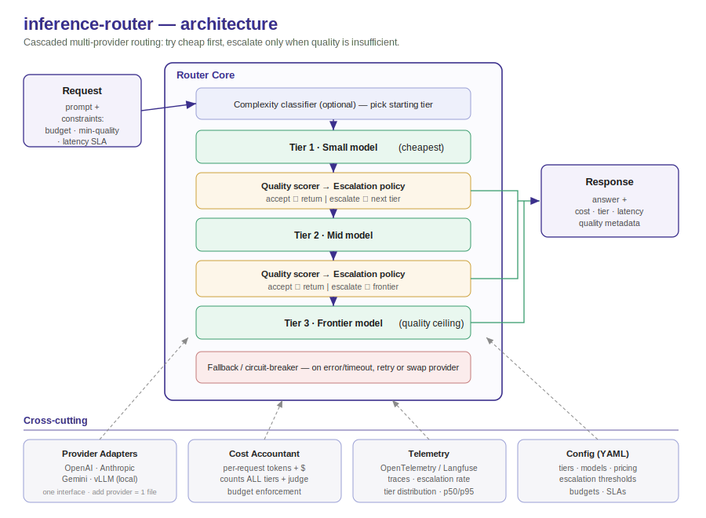

# LLMInferenceRouter

> Cascaded, multi-provider LLM routing: try the cheapest model first, escalate only when quality demands it — and prove the savings with a reproducible benchmark, not an asserted number.

[](https://github.com/kumarpraveendev/LLMInferenceRouter/actions)


<!-- HIGHEST-IMPACT ADD: record a 30–60s terminal demo (asciinema/Loom → GIF) of `make bench`
     producing the chart, and embed it here. A reviewer who sees it run trusts everything below. -->


*Cascade routing reaches near-frontier accuracy at a fraction of the cost. Numbers below are generated by `make bench` on a fixed public dataset — **replace the table with your own run's output before publishing.***

---

## Why this exists

An inference router is where the unit economics of an AI product are won or lost. The naive approach — send every request to the strongest model — is simple and ruinously expensive at scale. The cheap-looking approach — send everything to the smallest model and post the savings — quietly tanks quality on the requests that matter.

The honest version is harder: **spend frontier money only on the requests that actually need it.** This repo is a reference design for doing that well — try a cheap model first, measure whether its answer is good enough, and escalate only when it isn't — with the cost accounting and evaluation that make the tradeoff defensible.

This is a **reference design distilled from production work**, written to be read and run, not a framework to adopt wholesale.

## What it does

- **Cascaded routing** across small → mid → frontier model tiers, escalating on a quality signal
- **Provider-agnostic adapters** (OpenAI, Anthropic, Gemini, local/vLLM) behind one interface — adding a provider is one file
- **Per-request cost accounting** in real money, including any escalation-judge overhead
- **Fallback & circuit-breaking** on provider error or timeout
- **Config-driven** (YAML): tiers, models, pricing, thresholds, budgets
- **Observability hooks** (OpenTelemetry / Langfuse): escalation rate, tier distribution, latency
- **A reproducible cost-vs-quality benchmark** on a public dataset

## Results

Generated by `make bench` on a fixed 200-item GSM8K sample (exact-match accuracy, real provider pricing). **Replace these cells with your run — do not ship the placeholders.**

| Strategy | Accuracy | $ / 1k queries | p50 latency | p95 latency |
|---|---|---|---|---|
| frontier-only (baseline) | `<__%>` | `$<__>` | `<__>s` | `<__>s` |
| small-only (baseline) | `<__%>` | `$<__>` | `<__>s` | `<__>s` |
| **cascade (chosen point)** | **`<__%>`** | **`$<__>`** | `<__>s` | `<__>s` |

**Headline:** `<__>%` of frontier accuracy at `<__>%` lower cost. Full methodology in [`benchmarks/benchmark-design.md`](benchmarks/benchmark-design.md).

## Architecture



A request enters the router with optional constraints (budget, min-quality, latency SLA). An optional complexity classifier picks a starting tier; otherwise it starts cheapest. After each tier, a **quality scorer** feeds an **escalation policy** that either returns the answer or escalates to the next tier. A cost accountant tracks tokens and money across every call (including the judge), and a fallback layer handles provider errors. Configuration, pricing, and thresholds live in YAML.

## How the escalation decision works (the crux)

At runtime you can't peek at the correct answer to decide whether to escalate — so the escalation signal must be **answer-independent**. This repo uses **`<self-consistency | judge-model | logprob-confidence>`** ([ADR-0002](docs/adr/0002-cascade-routing-policy.md) explains the choice and the alternatives).

One thing this design is deliberately honest about: if a judge model decides escalation, **that judge call costs money and latency, and it is counted in the cost accounting.** Hiding it would inflate the savings — which is exactly the shortcut this project exists to avoid.

## Quickstart

```bash
git clone https://github.com/kumarpraveendev/LLMInferenceRouter
cd LLMInferenceRouter
cp .env.example .env          # add your provider API keys
pip install -r requirements.txt

python -m router.demo "What is 17% of 240?"   # route a single prompt
make bench                                      # reproduce the cost-vs-quality chart
```

## Configuration

```yaml
# config/router.yaml
tiers:
  - name: small
    model: <provider/small-model>
    price: { in: 0.15, out: 0.60 }   # USD / 1M tokens
  - name: frontier
    model: <provider/frontier-model>
    price: { in: 3.00, out: 15.00 }
escalation:
  signal: <self-consistency|judge|logprobs>
  threshold: 0.6
budgets:
  max_usd_per_request: 0.05
```

## Design decisions

The decisions a reviewer actually cares about live in short ADRs:

- [ADR-0001 — Provider abstraction](docs/adr/0001-provider-abstraction.md)
- [ADR-0002 — Cascade routing & the escalation signal](docs/adr/0002-cascade-routing-policy.md)
- [ADR-0003 — Fallback & circuit-breaking](docs/adr/0003-fallback-and-circuit-breaking.md)

## Running this in production

What this reference omits but a real deployment needs — and how I'd approach each:

- **Multi-tenancy & budgets:** per-tenant cost ceilings and rate limits; reject or downgrade rather than blow a budget.
- **Resilience:** retries with backoff, circuit-breakers per provider, and a deterministic fallback tier so a provider outage degrades quality rather than failing.
- **Secrets & security:** keys via a secrets manager, never in config; PII-aware logging.
- **Observability as SLOs:** track escalation rate, tier distribution, cost-per-request, and p95 latency as first-class SLOs — the cascade *adds* latency when it escalates, and you must watch that.
- **Eval in CI:** run the benchmark on every change so a routing tweak can't silently trade away quality.

## Honest limitations

- The benchmark is a single public dataset (GSM8K) with objective grading; open-ended tasks need a judge or win-rate metric, which is noisier.
- Cascading **adds latency** on escalated requests — a real tradeoff, shown in the results, not hidden.
- The escalation judge has its own error rate; tune the threshold to your tolerance for false "good enough" calls.

## Tech stack

Python · LLM provider SDKs (OpenAI, Anthropic, Gemini) · vLLM (local) · YAML config · OpenTelemetry / Langfuse · matplotlib (benchmark) · pytest · GitHub Actions

## About

I'm Praveen Kumar — an engineering leader focused on agentic systems and the economics of running LLMs in production. This router distills patterns from a production multi-provider inference platform I built at Amazon that was adopted as an org-wide reference standard (~70% serving-cost reduction). More work and contact at **[kumarpraveen.dev](https://kumarpraveen.dev)** · **[LinkedIn](https://www.linkedin.com/in/kumarpraveendev)**.

## License

MIT — see [LICENSE](LICENSE).
