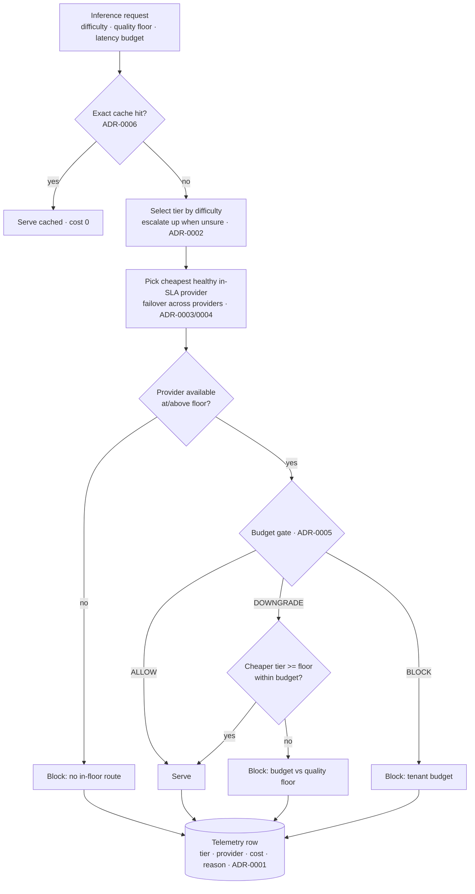

# Architecture

> Downstream of the [decisions](../decisions) by design. Each component links back
> to the ADR that justifies it. Start with the [README](../README.md); this is the
> evidence underneath it. Reference design — the patterns reflect a multi-provider
> inference platform I ran in production (~70% cost reduction vs a managed baseline).

## The stance

The router is a tier-0 service: every product depends on it, and it spends money on
their behalf. The architecture is organised around one idea — **spend the minimum
that still meets the quality and latency SLA, and never buy cost by breaching the
quality floor.** Every request is priced before a call is made, gated against a
budget, and recorded as a telemetry row that makes cost attributable.

## Request pipeline

## Components

| Component | File | Role | Decision |
|-----------|------|------|----------|
| Request model | [`src/request.py`](../src/request.py) | Request + ordered tiers (CHEAP/MID/STRONG) | — |
| Providers | [`src/providers.py`](../src/providers.py) | One interface over many providers; default pool | [ADR-0003](../decisions/0003-multi-provider.md) |
| Cost | [`src/cost.py`](../src/cost.py) | Per-request cost estimate from token counts | [ADR-0001](../decisions/0001-cost-per-successful-request.md) |
| Cache | [`src/cache.py`](../src/cache.py) | Exact-match TTL cache; never serves past TTL | [ADR-0006](../decisions/0006-caching.md) |
| Budget gate | [`src/budget.py`](../src/budget.py) | ALLOW / DOWNGRADE / BLOCK before any call | [ADR-0005](../decisions/0005-budget-governance.md) |
| Router | [`src/router.py`](../src/router.py) | Cascade by difficulty, failover, budget orchestration | [ADR-0002](../decisions/0002-difficulty-routing.md), [ADR-0004](../decisions/0004-failover-policy.md) |

The most load-bearing behaviour is in `router.select_tier`: difficulty maps to a
tier, but a low-confidence estimate routes **up**, never down — and there's a test
that fails if that ever flips. That single rule is ADR-0002 expressed as code.

## Two kinds of "degrade"

The router degrades in two directions, for two different reasons, and keeps them
distinct:

- **Availability failover (ADR-0004)** prefers to escalate *up* — if the desired
  tier has no healthy in-SLA provider, a stronger tier still meets the quality
  floor, so quality is preserved.
- **Budget downgrade (ADR-0005)** moves *down* toward the floor — but never below
  it. If no tier at or above the floor fits the budget, the request is blocked.

## Failure modes

| Failure | Behaviour |
|---------|-----------|
| Provider unhealthy / too slow | Skipped at selection; failover within and across tiers ([ADR-0004](../decisions/0004-failover-policy.md)) |
| Whole desired tier down | Escalate up (preserves floor); only block if no in-floor tier has capacity |
| Route exceeds per-request ceiling | Downgrade to a cheaper tier >= floor; block if none fits ([ADR-0005](../decisions/0005-budget-governance.md)) |
| Tenant budget exhausted | Block — protects other tenants' share |
| Cost change lowers quality | Caught at merge by the eval gate ([ADR-0007](../decisions/0007-quality-gate.md)) |

## Technology choices and the buy boundary

| Layer | Choice | Build / Buy |
|-------|--------|-------------|
| Provider connectivity, auth, token accounting, streaming | Gateway / SDK | **Buy** ([ADR-0008](../decisions/0008-build-vs-buy.md)) |
| Cascade routing policy + conservative-up default | Custom | **Build** |
| Budget gate | Custom | **Build** |
| Eval harness | Custom | **Build** |
| Cache, telemetry store | Managed infra | **Buy / managed** |

The built layers sit above the gateway and stay gateway-agnostic, so the plumbing
can change without rewriting the policy — the portability guardrail from ADR-0008.

---

*Reference architecture for a design by Praveen Kumar. The load-bearing content is
the mapping from each component back to the decision that justifies it.*
